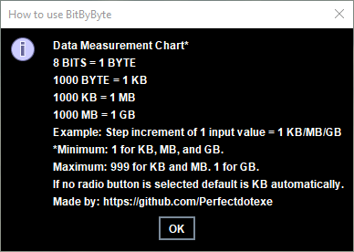

<p align="center">
  
</p>

[](https://travis-ci.org/akashnimare/foco)
[](https://ci.appveyor.com/project/akashnimare/foco/branch/master)
[](https://github.com/feross/standard)

## BitByByte-File-Pumper
Increases the size of a file by adding null hexadecimal value(s) (00) to the end depending on the amount the user wants in KB, MB, or GB. Usually, anti-virus softwares ignore files bigger than 100 MB therefore qualifiying this file pumper useful in that situation. Another way it could be used is for phising or testing a networks download speed. Above all, this is a penetration testing tool, not a blackhat tool.

## Motivation
The graphical user interface was programmed line by line, I didn't use WindowBuilder (Eclipse) to make the GUI. Reasoning why is that I took this up as a challenge to better understand how GUI's work using Java and low-level functions. Above all, it is user friendly and I'm not responsible for any damages.

## Screenshots
<br/><br/><br/>

## Tech/framework used
- [Eclipse](https://www.eclipse.org/)
- [Java](https://www.java.com/)

## Features
Write once, run anywhere. Currently there isn't a file pumper out there programmed in Java, there was one, but it's gone now.

## Code Example
```public void actionPerformed(java.awt.event.ActionEvent evt) {
int valueUserMain = (Integer) valueBox.getValue(); // Grabs valueBox value.
byte[] nullValue = new byte [1]; // Placeholder for length.
FileChannel rwChannel = null;
writeRead = rwChannel.map(FileChannel.MapMode.READ_WRITE, 0, nullValue.length * valueUserMain * x.get() / 2); // Multiples and divides for correct file size.
for (int i1 = 0; i1 < valueUserMain; i1++) // Creates a for loop based on the valueUserMain value.
{
try {
rwChannel.write(writeRead); // Writes data according to writeRead multiplication/division.
} catch (IOException e) {
e.printStackTrace();
} while (i1 == valueUserMain);
```

**Data table:**<br/>
**8 BITS = 1 BYTE**<br/>
**1000 BYTE = 1 KB**<br/>
**1000 KB = 1 MB**<br/>
**1000 MB = 1 GB**<br/>
**1000 GB = TB**<br/>

## Installation
You can download the JAR file <a href="https://github.com/Perfectdotexe/BitByByte-File-Pumper/raw/master/BitByByte.jar">here</a>.

## How to use?
Example: Step increment of 1 input value = 1 KB/MB/GB<br/>
Minimum: 1 for KB, MB, and GB. Maximum: 999 for KB and MB. 1 for GB.<br/>
If no radio button is selected default is KB automatically.

## Contribute
If you would like to contribute, just fork and push an update or make an issue.

## License
Creative Commons Attribution 4.0 International License. <a href="https://github.com/Perfectdotexe">Perfect.exe</a>
